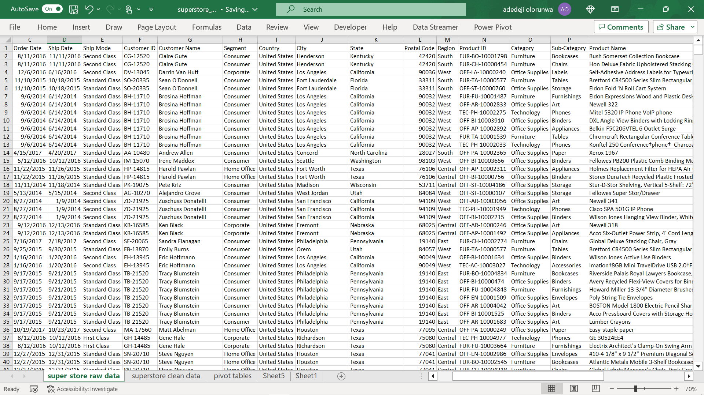
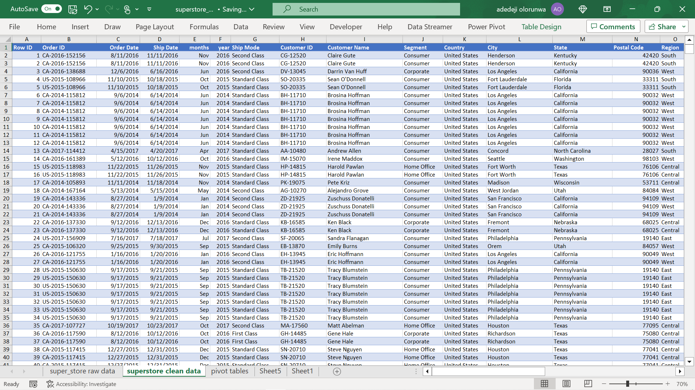

# SUPERSTORE-sales-report
-------
## Introduction

This simple business analysis delves into an in-depth examination of the sales and revenue generated within the **US SUPERSTORE.** By meticulously dissecting the financial metrics and performance indicators, this study provides invaluable insights aimed at optimizing revenue generation and promoting future sales growth. The basic analytical approach employed in this investigation aims to unearth hidden patterns, identify strategic opportunities, and harness the power of data-driven decision-making to propel the business towards heightened success in the upcoming year. By leveraging on these basic analytics, this study empowers stakeholders to make well-informed choices, capitalize on market trends, and fortify their competitive advantage in the dynamic landscape of the US superstore. 

-------

### Problem Statement

1.  Among the various categories of products sold by the store, which specific categories exhibited a higher propensity to generate substantial     revenue? 
2.  Can I provide an in-depth analysis comparing the revenue generated over different months within a year and evaluate the year-on-year revenue  growth?
3.  I am interested in understanding the relative proportions of revenue generated within each segment, which would shed more light on the distribution of income sources.
4.  Could I elaborate on the sales distribution patterns across different cities or regions, which would provide insights into the geographical performance of the business? 
5.  I would like to gain insights into the revenue generated by each sub-category, as this information could reveal the most lucrative areas of     the business. 
6.  Can I provide a comprehensive overview of the total quantity sold across all products, indicating the overall sales volume? 
7.  I am keen on conducting an analysis of the expenditure patterns in relation to the customer's preferred mode of shipment of ordered goods and   evaluate how these choices impact the overall revenue generation.

--------

### Skills Demonstrated
- Data extraction, 
- Data Cleaning, 
- Pivot Tabling of Data,
- Visual Reporting of analysis

------
### Data Sourcing

This analysis was conducted using proprietary internal acquisition data sourced from the US superstore Database, thoughtfully curated, and made available by the instructor. By delving into the depths of the data, I aimed to uncover hidden relationships, discern underlying trends, and conduct a comprehensive exploration of key performance metrics. 

 

 

 

Let us dive in 👊👊👊 

-------
### Data Cleaning

The initial raw dataset, comprising 20 columns and 9995 rows, was thoughtfully prepared and provided for analysis. In the data preparation phase, three additional columns were introduced to enhance the dataset's analytical capabilities. Two of these new columns were designed to extract the relevant information regarding the month and year from the shipment day, thereby facilitating a comprehensive analysis across various months and years. The third additional column served the purpose of calculating the actual price of the product sales, augmenting the dataset's value and enabling a more profound understanding of revenue generation. 

As a result of these strategic data enhancements, the dataset was expanded to encompass 23 columns and continued to maintain its original 9995 rows. The meticulous data cleaning process was executed proficiently, ensuring the dataset remained free from missing data points and outliers, which could have potentially skewed the analytical outcomes. This attention to data quality further bolstered the dataset's reliability, making it an optimal foundation for conducting robust and accurate analytics. With the dataset now primed and enriched with pertinent information, it serves as a valuable resource for in-depth business analysis, providing critical insights to guide decision-making and drive future success in the US superstore market. 

--------

### Data analyzing using PIVOT TABLEs

